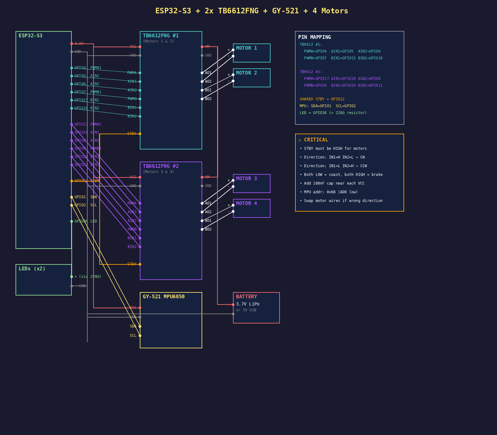

# 🚁 ESP32-S3 Quadcopter Drone Controller

A lightweight, web-controlled quadcopter flight controller built on the ESP32-S3 platform. Features real-time telemetry, virtual dual-joystick control via smartphone/tablet, and basic PID stabilization using the MPU6050 IMU.



## ✨ Features

- **📱 Web-Based Control**: No app installation required—control via any smartphone browser using virtual joysticks
- **⚡ WiFi AP Mode**: Creates its own network (`DRONE`) for standalone operation
- **🔧 Real-time Telemetry**: Live feedback of pitch, roll, motor speeds, and armed status
- **🎮 Dual-Radio Style Controls**: Standard mode 2 layout (throttle/yaw on left, pitch/roll on right)
- **🔒 Safety Features**: Software disarm/kill switch, standby pin control for motor drivers
- **⚖️ PID Stabilization**: Basic attitude hold using complementary filter and PID control

## 🛠️ Hardware Requirements

| Component | Specification | Notes |
|-----------|--------------|-------|
| **Microcontroller** | ESP32-S3 dev board | Ensure 3.3V logic level |
| **Motor Drivers** | 2x TB6612FNG | Dual H-bridge, 1.2A continuous per motor |
| **Motors** | 4x Coreless DC (7x16mm or 8x20mm) | 3.7V rated |
| **IMU Sensor** | GY-521 (MPU6050) | I2C interface, address 0x68 |
| **Power** | 3.7V LiPo (300-600mAh) | With JST-PH connector |
| **Misc** | LEDs, resistors (220Ω), 100nF capacitors | For VCC filtering |

### 📌 Pin Mapping

| Function | GPIO | Identifier |
|----------|------|------------|
| **Motor 1** | 4 (PWM), 5 (IN1), 6 (IN2) | Front-Left |
| **Motor 2** | 7 (PWM), 15 (IN1), 16 (IN2) | Front-Right |
| **Motor 3** | 17 (PWM), 18 (IN1), 8 (IN2) | Rear-Left |
| **Motor 4** | 9 (PWM), 10 (IN1), 11 (IN2) | Rear-Right |
| **STBY** | 12 | Shared standby (must be HIGH) |
| **I2C SDA** | 1 | MPU6050 data |
| **I2C SCL** | 2 | MPU6050 clock |
| **Status LED** | 38 | Armed indicator |

## 💻 Software Dependencies

Install these libraries via Arduino Library Manager or PlatformIO:

- `ESPAsyncWebServer` (by me-no-dev)
- `AsyncTCP` (by me-no-dev) 
- `ArduinoJson` (by Benoit Blanchon)
- `WiFi` (built-in for ESP32)

### Arduino IDE Setup

1. Add ESP32 board package: `https://espressif.github.io/arduino-esp32/package_esp32_index.json`
2. Select board: **ESP32-S3 Dev Module**
3. Partition Scheme: **Huge APP** (3MB No OTA/1MB SPIFFS) recommended for web server space

## 🚀 Installation

1. **Wire the hardware** according to the diagram above
   - Ensure 100nF caps near each TB6612FNG VCC pin
   - Connect all GND lines (common ground essential)
   - Verify motor direction (swap wires if spinning wrong way)

2. **Upload the code**
   ```bash
   # PlatformIO users
   platformio run --target upload
   
   # Or use Arduino IDE
